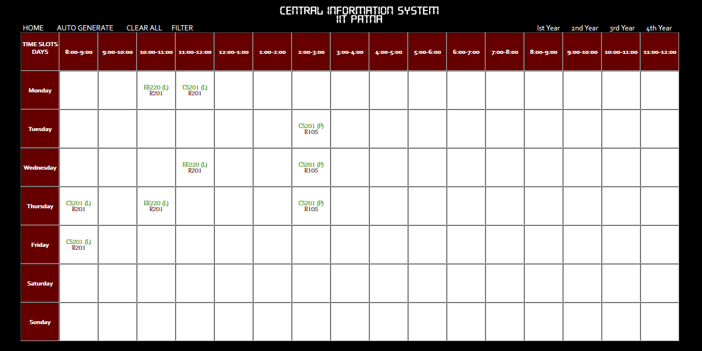
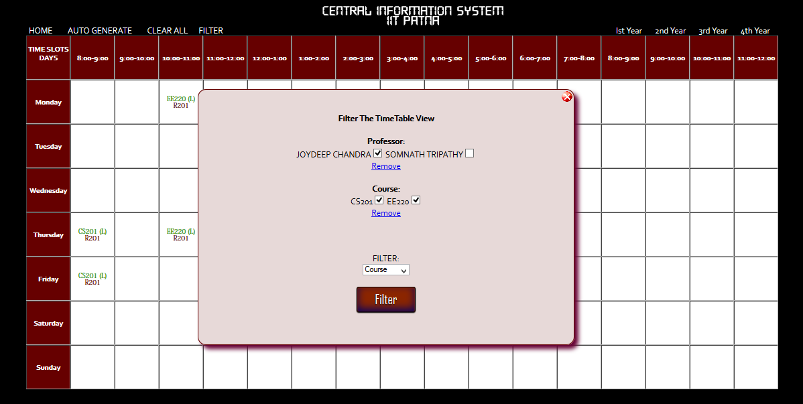
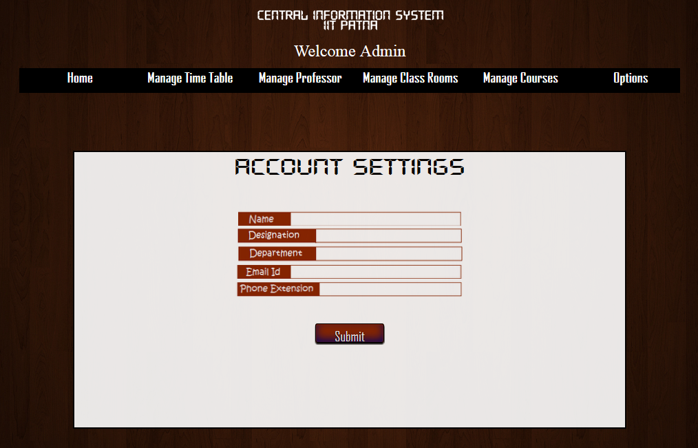

GENERAL FUNCTIONS
=================

General functionalities include the following:

View Timetable
--------------

User can view the existing timetable of any year of B.Tech.
This timetable includes not only the academic timetable but also
the different activities going on around the college, e.g. activities,
extra classes, college club activities, workshops, etc.

Filter
------

User can view the Timetable using various filters.
Different types of filtering are available:

	- *branch-wise filtering*: Filter your timetable view according to the different academic branches present.
	- *course-wise filtering*: Filter your timetable view according to various courses.
	- *professor-wise filtering*: Filter your timetable voew with respect to the Professors teaching the course.

CIS allows usage of one or more filters at the same time.

Change personal details
-----------------------

User can change his/her personal details.

