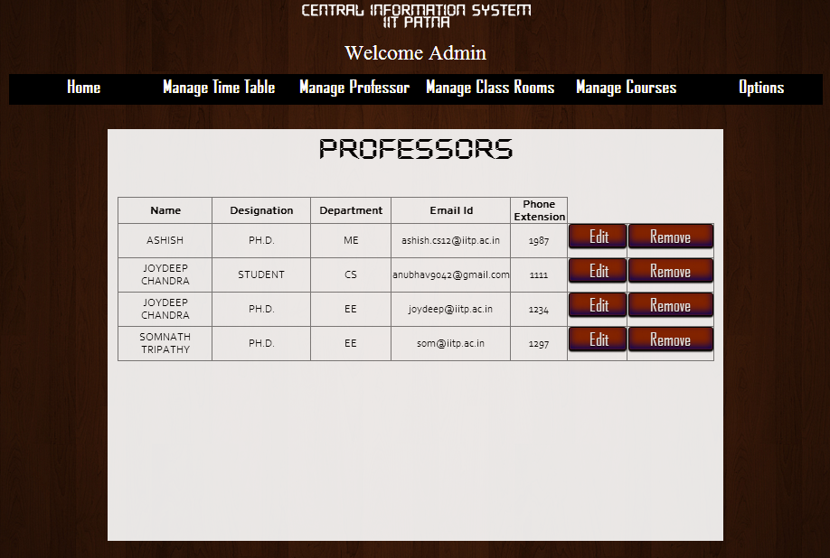

USER SPECIFIC FUNCTIONS
=======================

User Specific Functionalities:

- `Admin`_
- `Professor`_
- `Student`_

ADMIN
-----

In addition to the :doc:`general functionalities <functions_gen>`, admin has the following functions.

Edit Timetable
~~~~~~~~~~~~~~

- Admin has full excess to change the timetable.
- Admin auto-generate the timetable for the whole semester.
- Admin manually edit the timetable as per the request made by the professors like shifting of classes, adding extra classes, seminars etc.

.. image:: _static/edit_tt.png
	:height: 500px
	:width: 1200 px
	
Manage Professors
~~~~~~~~~~~~~~~~~

- Admin can add new professors to the database and edit existing professors.
- Admin can view and remove existing professors from the database.

.. image:: _static/edit_prof.png
	:height: 380px
	:width: 500 px

Manage Rooms
~~~~~~~~~~~~

- Admin can add rooms to the database.
- Admin can view and remove existing room from the database.

.. image:: _static/room_home.png
	:height: 275px
	:width: 350 px

.. image:: _static/add_room.png
	:height: 275px
	:width: 350 px

.. image:: _static/manage_room.png
	:height: 275px
	:width: 350 px

Manage Courses
~~~~~~~~~~~~~~
- Admin can add new courses to the database and edit existing courses(like there teaching professor, semester in which it will be teached etc.).
- Admin can view and remove existing courses from the database.

.. image:: _static/coursehome.png
	:height: 275px
	:width: 350 px

.. image:: _static/manage_courses.png
	:height: 275px
	:width: 350 px

Accept Request
~~~~~~~~~~~~~~

- Admin can accept the requests made by the professors and schedule the extra classes or seminars as per the request.

PROFESSOR
---------

View Timetable
~~~~~~~~~~~~~~

- Professors can view their own  timetable.

View Professors
~~~~~~~~~~~~~~~

- Professors can view the details of other professors in the database.

.. image:: _static/view_prof.png
	:height: 500px
	:width: 1000 px

View Rooms
~~~~~~~~~~

- Professors can view the rooms available for teaching.

.. image:: _static/view_rooms.png
	:height: 500px
	:width: 1000 px

View Courses
~~~~~~~~~~~~

- Professors can view the details of the courses present in the database of various years.

Make Requests
~~~~~~~~~~~~~

- Professors can make request for extra classes or seminars to the admin.

.. image:: _static/prof_req.png
	:height: 275px
	:width: 525 px

STUDENT
-------

Make/View Appointments
~~~~~~~~~~~~~~~~~~~~~~

- Students can make appointments to the professors.
- Students can view the appointments made by the them to various professors with there timings.

.. image:: _static/make_appoint.png
	:height: 400px
	:width: 800 px

Make Requests
~~~~~~~~~~~~~

- Students can make request for extra classes and club meeting to the professor and admin.

.. image:: _static/view_appoint.png
	:height: 400px
	:width: 800 px
